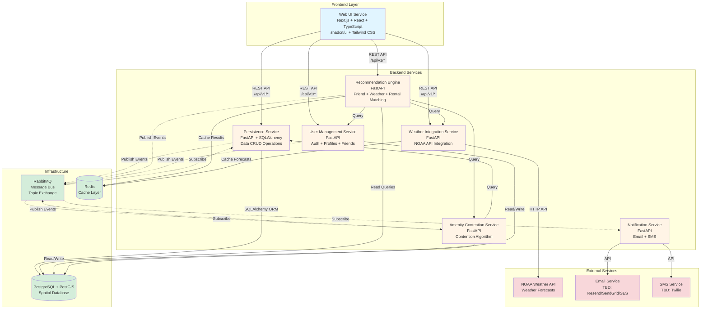

# Architecture

## Executive Summary

Lakeplanner uses a microservices architecture with Python FastAPI backend services and a Next.js React frontend. The persistence service is already implemented with PostgreSQL/PostGIS, SQLAlchemy ORM, and RabbitMQ message bus. This architecture document captures all architectural decisions to ensure consistent implementation across AI agents.

## System Architecture



**Architecture Overview:**

- **Frontend Layer:** Next.js React application with TypeScript, Tailwind CSS, and shadcn/ui components
- **Backend Services:** 6 microservices built with FastAPI, each handling a specific domain
- **Infrastructure:** PostgreSQL/PostGIS for spatial data, RabbitMQ for event-driven communication, Redis for caching
- **External Services:** NOAA Weather API for forecasts, email/SMS providers for notifications

**Communication Patterns:**
- **REST APIs:** Frontend communicates with backend services via REST (`/api/v1/*`)
- **Message Bus:** Services publish/subscribe to events via RabbitMQ topic exchange
- **Direct Queries:** Services query PostgreSQL directly for data operations
- **Cache Layer:** Redis used for recommendation results and weather forecast caching

## Architecture Critique & Simplification Recommendations

### Critical Issues Identified

**1. Over-Decomposition (6 Services for MVP)**
- **Problem:** Too many services for MVP scale increases operational complexity
- **Impact:** Higher deployment overhead, more network calls, harder debugging
- **Recommendation:** Consolidate to 2-3 services for MVP

**2. Distributed Monolith Risk**
- **Problem:** Multiple services share same database (lines 44-46 in diagram)
- **Impact:** Services coupled via schema, defeats microservices benefits
- **Recommendation:** Single service owns database, others call via API

**3. Service Boundary Confusion**
- **Problem:** User Management duplicates Persistence (Persistence already has User models)
- **Impact:** Duplication, unclear ownership
- **Recommendation:** Merge User Management into Persistence Service

**4. Message Bus Complexity**
- **Problem:** RabbitMQ adds operational overhead for MVP
- **Impact:** More infrastructure to manage, async complexity
- **Recommendation:** Use synchronous calls for MVP, add RabbitMQ later

**5. Tight Coupling**
- **Problem:** Recommendation service calls 3 other services (high latency, failure points)
- **Impact:** Slow responses, complex error handling
- **Recommendation:** Consolidate or use library functions instead of service calls

### Recommended Simplified MVP Architecture

**Option A: Monolithic Backend (Simplest)**
- **Single Backend Service:** FastAPI app with all domains as modules
- **Benefits:** Simple deployment, fast development, easy debugging
- **Tradeoff:** Can't scale services independently (fine for MVP)

**Option B: 2-Service Split (Balanced)**
- **Core Service:** Persistence + User Management + Weather + Contention (all data/domain logic)
- **Recommendation Service:** Aggregates from Core Service via REST API
- **Benefits:** Separates complex recommendation logic, still manageable
- **Tradeoff:** Some duplication of models/utilities

**Option C: 3-Service Split (Current Simplified)**
- **Persistence Service:** All CRUD + User Management + Auth (already exists)
- **Recommendation Service:** Friend matching + Weather + Contention (orchestration)
- **Notification Service:** Email/SMS (async, can be simple)
- **Benefits:** Clear separation, manageable complexity
- **Tradeoff:** Still some coupling via database

### Specific Simplifications

**1. Remove Redis (MVP)**
- Weather caching: Use in-memory dict with TTL in Weather module
- Recommendation caching: Skip for MVP, add later if needed
- **Saves:** One infrastructure component

**2. Simplify Message Bus (MVP)**
- Keep RabbitMQ for audit logging (already implemented)
- Use synchronous REST calls for notifications (simpler)
- Add async patterns later when needed
- **Saves:** Complex event handling logic

**3. Merge User Management into Persistence**
- Persistence already has User models
- Add auth endpoints to Persistence Service
- **Saves:** One service, eliminates duplication

**4. Consolidate Weather + Contention into Recommendation**
- Weather: Simple NOAA API wrapper (library function)
- Contention: Algorithm (library function)
- Recommendation Service calls these as functions, not services
- **Saves:** Two services, reduces network calls

### Recommended MVP Architecture (Simplified)

**2 Services:**
1. **Core Service** (Persistence + User Mgmt + Weather + Contention)
   - All data operations
   - User authentication
   - Weather API integration (simple wrapper)
   - Contention algorithm (library function)
   
2. **Recommendation Service**
   - Aggregates data from Core Service
   - Friend matching logic
   - Ranking and sorting

**3 Services (if notifications needed):**
- Add Notification Service for async email/SMS

**Infrastructure:**
- PostgreSQL/PostGIS (required)
- RabbitMQ (for audit logging only - already implemented)
- ~~Redis~~ (remove for MVP)

**Migration Path:**
- Start with simplified architecture
- Split services later when you hit scaling issues
- Add Redis when caching becomes necessary
- Expand RabbitMQ usage when async patterns needed

## Project Initialization

**Frontend Starter Command:**
```bash
npx create-next-app@latest lakeplanner-frontend --typescript --tailwind --app --eslint
```

This establishes the base frontend architecture with:
- Next.js App Router
- TypeScript
- Tailwind CSS
- ESLint

**Note:** This should be the first implementation story in Epic 1 (Foundation & Infrastructure).

## Decision Summary

| Category | Decision | Version | Affects Epics | Rationale |
| -------- | -------- | ------- | ------------- | --------- |
| Frontend Framework | Next.js (App Router) | Latest | All frontend epics | PROVIDED BY STARTER - Modern React framework with SSR/SSG |
| Frontend Language | TypeScript | Latest | All frontend epics | PROVIDED BY STARTER - Type safety for React |
| Frontend Styling | Tailwind CSS | Latest | All frontend epics | PROVIDED BY STARTER - Utility-first CSS framework |
| Frontend Linting | ESLint | Latest | All frontend epics | PROVIDED BY STARTER - Code quality |
| Backend Framework | FastAPI | 0.109.0 | All backend epics | ALREADY ESTABLISHED - Python async web framework |
| Backend Language | Python | 3.11 | All backend epics | ALREADY ESTABLISHED - Python 3.11 |
| ORM | SQLAlchemy | 2.0.25 | Persistence, all data epics | ALREADY ESTABLISHED - Mature Python ORM |
| Database | PostgreSQL with PostGIS | 16-3.5 | All data epics | ALREADY ESTABLISHED - Spatial queries required |
| Migrations | Alembic | 1.13.1 | Persistence epic | ALREADY ESTABLISHED - SQLAlchemy migrations |
| Message Bus | RabbitMQ | 3.13 | All event-driven epics | ALREADY ESTABLISHED - Topic exchange pattern |
| Message Bus Client | aio-pika | 9.3.1 | All event-driven epics | ALREADY ESTABLISHED - Async RabbitMQ client |
| Validation | Pydantic | 2.5.3 | All API epics | ALREADY ESTABLISHED - FastAPI integration |
| API Server | Uvicorn | 0.27.0 | All backend epics | ALREADY ESTABLISHED - ASGI server |
| Caching | Redis | 7-alpine | Recommendation, Weather epics | ALREADY ESTABLISHED - Infrastructure ready |
| Monitoring | Prometheus | Client 0.19.0 | All epics | ALREADY ESTABLISHED - Metrics collection |
| Container Runtime | Docker | Latest | All epics | ALREADY ESTABLISHED - Containerization |
| Design System | shadcn/ui | Latest | Frontend UI epic | UX SPEC DECISION - Accessible component library |

## Project Structure

```
{{project_root}}/
{{source_tree}}
```

## Epic to Architecture Mapping

{{epic_mapping_table}}

## Technology Stack Details

### Core Technologies

{{core_stack_details}}

### Integration Points

{{integration_details}}

{{novel_pattern_designs_section}}

## Implementation Patterns

These patterns ensure consistent implementation across all AI agents:

{{implementation_patterns}}

## Consistency Rules

### Naming Conventions

{{naming_conventions}}

### Code Organization

{{code_organization_patterns}}

### Error Handling

{{error_handling_approach}}

### Logging Strategy

{{logging_approach}}

## Data Architecture

{{data_models_and_relationships}}

## API Contracts

{{api_specifications}}

## Security Architecture

{{security_approach}}

## Performance Considerations

{{performance_strategies}}

## Deployment Architecture

{{deployment_approach}}

## Development Environment

### Prerequisites

{{development_prerequisites}}

### Setup Commands

```bash
{{setup_commands}}
```

## Architecture Decision Records (ADRs)

{{key_architecture_decisions}}

---

_Generated by BMAD Decision Architecture Workflow v1.0_
_Date: {{date}}_
_For: {{user_name}}_

